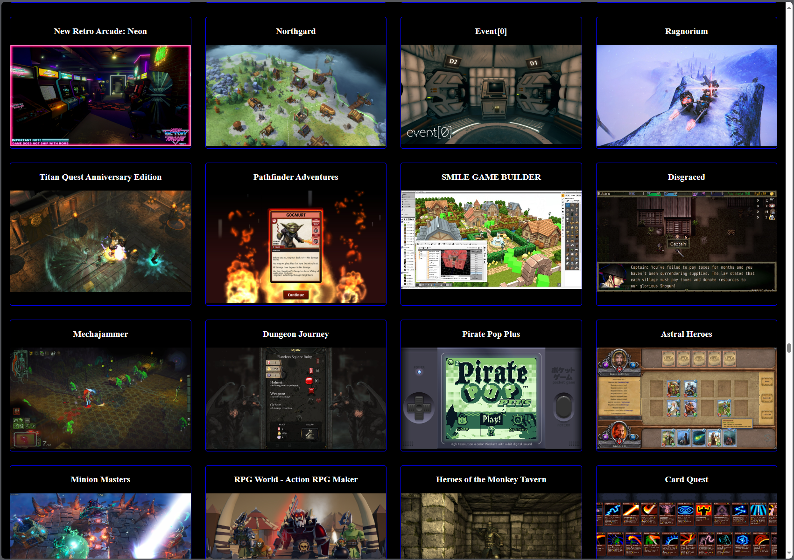
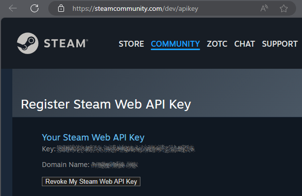
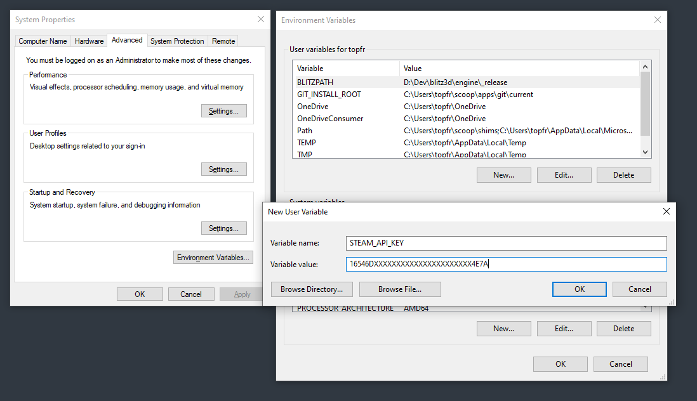
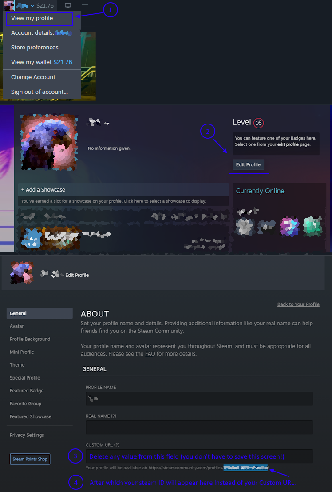

<h1>SteamLibApp</h1>

SteamLibApp helps you browser your Steam Librayr in a more interesting way by showing you the same screenshots used in the store itself. This makes the stuff you already bought look as interesting as the stuff you want to buy, thereby helping you play through your library more completely.

(Click image for full size)

SteamLibApp is a flask application. To run it, you need to install python. I recommend using scoop to do this on Windows.

<ol>
	<li>Go to <a href="https://scoop.sh">scoop.sh</a></li>
	<li>Follow the installation steps on the page</li>
	<li>Open a new cmd.exe window (or Terminal on Windows 11) and run: 
		<code>scoop install python</code></li>
	<li>Then install the Python packages we need via <code>pip</code>: 
		<code>pip install flask requests</code></li>
</ol>

You then need set two values in your environment variables to make the program work:

<ul>
	<li>Your Steam Web API Key</li>
	<li>Your library ID / profile ID</li>
</ul>

To get and store your API key:

<ol>
	<li>Go to this page to get your <code>Steam Web API Key</code>: <a href="https://steamcommunity.com/dev/apikey">https://steamcommunity.com/dev/apikey</a> 
		
(Click image for full size)
</li>
	<li>Copy the long string from the page above.</li>
	<li>Create a new environment variable: 
		a. Go to Start Menu > search for "Edit the system environment variables" 
		b. Click Environment Variables button 
		c. Click the top "New" button 
		d. Set <code>Variable name</code> to <code>STEAM_API_KEY</code> and <code>Variable value</code> from the above page 
	</li>
</ol>

Example:

(Click image for full size)

To get and store your library/steam/profile ID, open steam then click on your Profile name in the toolbar at the top right, then follow these steps:

(Click image for full size)

Set the value from these instructions in a new environment variable named <code>DEFAULT_STEAM_LIBRARY_ID</code> (follow instructions for storing your API key above).

<h2>Run it</h2>

Now you can run the app, close all your console/terminal windows and open a new one to ensure the variables are loaded.

Type `cd` then paste the path you downloaded this program to, for instance if you put it at <code>C:\ProgramData\SteamLibApp</code> type:
	<pre>cd C:\ProgramData\SteamLibApp</pre>

Now run it with Python:

<pre>python SteamLibApp.py</pre>

The result should be something like this:

<pre>
C:\>cd C:\ProgramData\SteamLibApp
C:\ProgramData\SteamLibApp>python SteamLibApp.py
 * Serving Flask app 'SteamLibApp'
 * Debug mode: on
WARNING: This is a development server. Do not use it in a production deployment. Use a production WSGI server instead.
 * Running on http://127.0.0.1:5000
Press CTRL+C to quit
 * Restarting with stat
 * Debugger is active!
 * Debugger PIN: 695-934-644

You can now to go <a href="http://127.0.0.1:5000/library/">http://127.0.0.1:5000/library/</a> to view your Steam Library.

<b>Important!</b> If you have a large library, the first page load will take <b>a very, very long time</b>, probably a minute or two in some cases. You can view progress in the command window, just leave the browser window open until it completes. Be patient, or don't! I'm not your dad. It will pickup where it left off if you cancel it and try again later.

<b>Note:</b> To pick up where it left off, and to prevent calling too many API calls to often, the app caches data in <code>steam_cache.db</code>.

<h2>Troubleshooting</h2>

If you get a JSONDecode error, the environment variables are probably not set properly. Double check them, and restart your computer if they are set correctly, then try again. Open a Github issue if you can't get it to work and I'll try to help.

